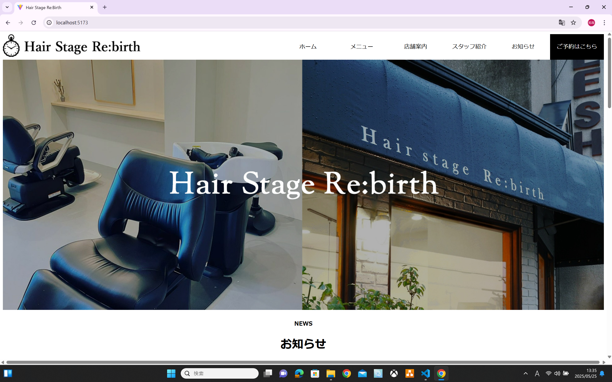
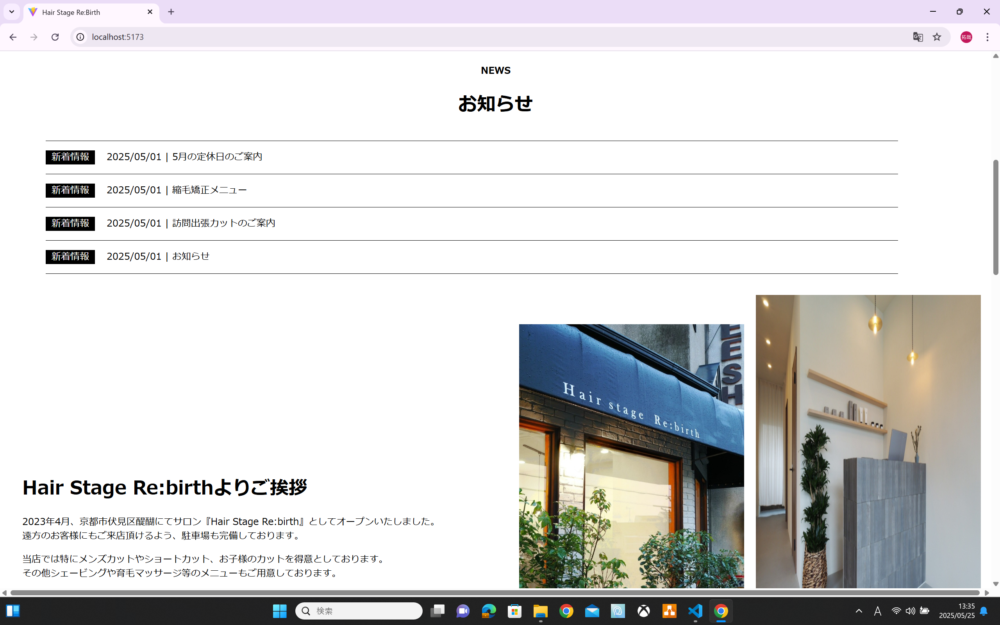

## 概要

美容院の HP を React に改修  
実際の HP は下記  
https://hairstagerebirth.com/

CSS は ChakraUI とか使えば楽ですが、サイトが大きくないのと、自分自身の CSS 復讐のためにもカスタムしています。  
レスポンシブデザインも対応

## 目的

保守性アップと実運用する為のポートフォリオ的なもの

## コーディング規約

・セクションごとにコンポーネントを使いできるだけ保守性を高めること  
・コンポーネントフォルダはページごとにフォルダ分けするなど分かりやすい状態にすること  
・レスポンシブデザインに対応すること

## 画面イメージ




## ルータ方式

https://qiita.com/Taira0222/items/883aa7d22cbf0d3a08de
バージョン一緒なのでこれでやった

```
npm install react-router-dom
```

## Tailwindcss のセットアップ

パッケージのインストールと config ファイルの作成

```
npm install -D tailwindcss@^3.4.0 postcss autoprefixer
npx tailwindcss init -p
```

tailwind.config.js に下記を追加

```
/** @type {import('tailwindcss').Config} */
export default {
  content: ["./index.html", "./src/**/*.{js,ts,jsx,tsx}"],
  theme: {
    extend: {},
  },
  plugins: [],
};
```
